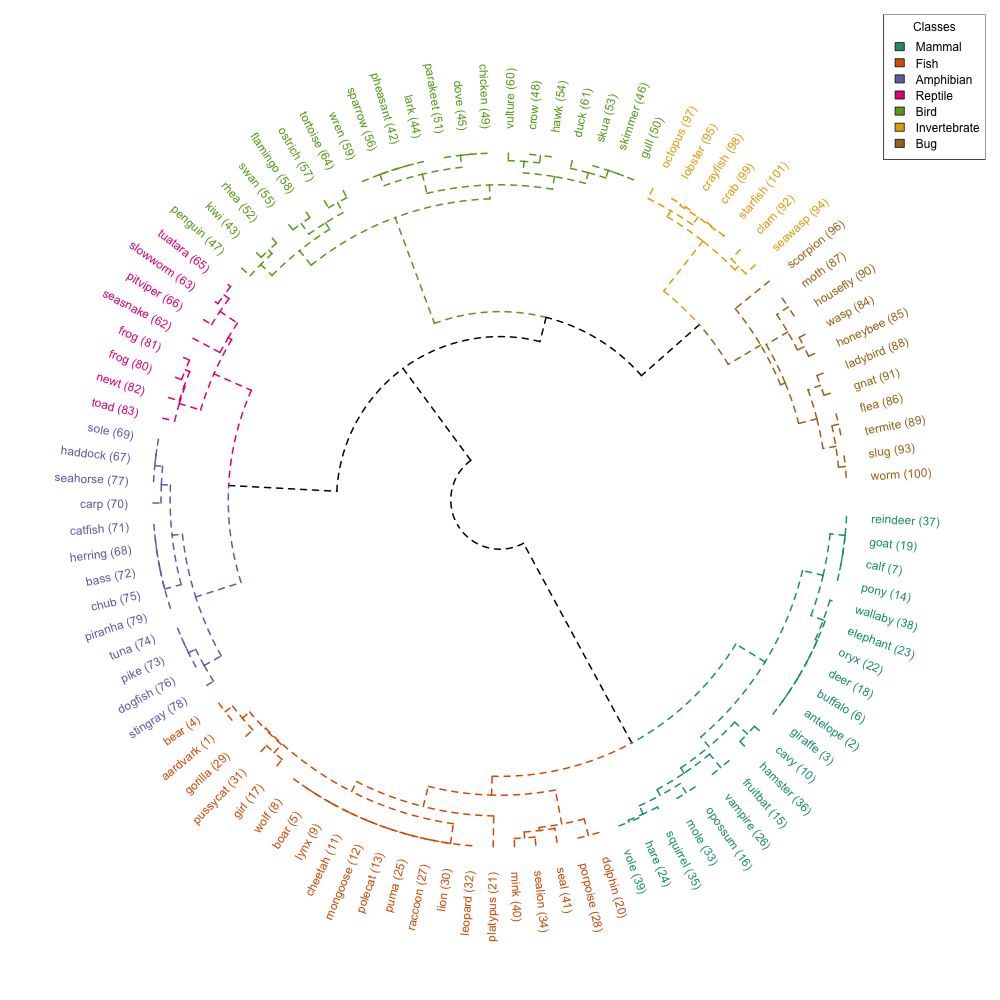

```{r setup, include=FALSE}
knitr::opts_chunk$set(echo = TRUE)
```

```{r load_libraries, include=FALSE}
# Librerías
if(!require("circlize")) install.packages("circlize"); library("circlize")
if(!require("dendextend")) install.packages("dendextend"); library("dendextend")
if(!require("cluster")) install.packages("cluster"); library("cluster")
if(!require("RColorBrewer")) install.packages("RColorBrewer"); library("RColorBrewer")
```

# Circular Dendrogram

Dataset: [**Zoo Animal Classification**](https://www.kaggle.com/datasets/uciml/zoo-animal-classification) de Kaggle

Se han usado: **zoo** y **class**

## Preparación del dataset

```{r echo=TRUE, message=FALSE, warning=FALSE}
zoo_simple <- read.csv('data/zoo.csv')
zoo_class <- read.csv('data/class.csv')
zoo_tmp <- merge(zoo_simple, zoo_class, by.x = "class_type", by.y = "Class_Number")
zoo_tmp$class <- as.factor(zoo_tmp$Class_Type)
zoo <- zoo_tmp[, c("animal_name", "hair", "feathers", "eggs", "milk", "airborne", "aquatic", "predator", "toothed", "backbone", "breathes", "venomous", "fins", "legs", "tail", "domestic", "catsize", "class", "class_type")]
```

## Dendrogram haciendo clustering con sus atributos

```{r echo=TRUE, message=FALSE, warning=FALSE}
zoo_subset <- zoo[, c("hair", "feathers", "eggs", "milk", "airborne", "aquatic", 
                   "predator", "toothed", "backbone", "breathes", 
                   "venomous", "fins", "legs", "tail", "domestic", "catsize"), drop = FALSE]
# Matriz de distancias
dist_matrix <- daisy(zoo_subset, metric = "gower")

# Clúster jerárquico
hclust_res <- hclust(dist_matrix, method = "ward.D2")
dend <- as.dendrogram(hclust_res)

# Colores
speciesLen <- length(unique(zoo$class))
mycol <- brewer.pal(speciesLen, "Dark2")

dend <- dend %>%
  color_branches(k = speciesLen, col = mycol)  %>%
  set("branches_lwd", 2) %>%  # Grosor de línea
  set("branches_lty", 2) %>%  # Tipo de línea
  color_labels(k = speciesLen, col = mycol)

par(mar = c(1, 1, 1, 1))

# Etiqueta las hojas del dendrogram con los nombres de los animales
labels(dend) <- paste(as.character(zoo[,c("animal_name")])[order.dendrogram(dend)], " (", labels(dend), ")", sep = "")

# Abre un dispositivo gráfico PNG
png("dendrograma_circular_by_attributes.png", width = 1000, height = 1000)
circlize_dendrogram(dend,
                    labels_track_height = NA,
                    dend_track_height = 0.7)
# Leyenda dendrogram
class_names <- as.character(zoo[, c("class")])[order.dendrogram(dend)]
legend("topright", legend = unique(class_names), fill = mycol, title = "Classes")
# Cierra el dispositivo gráfico
dev.off()
```



## Dendrogram usando la etiqueta de su clase

```{r echo=TRUE, message=FALSE, warning=FALSE}
zoo_subset <- zoo[, c("class"), drop = FALSE]
# Matriz de distancias
dist_matrix <- daisy(zoo_subset, metric = "gower")

# Clúster jerárquico
hclust_res <- hclust(dist_matrix, method = "ward.D2")
dend <- as.dendrogram(hclust_res)

# Colores
speciesLen <- length(unique(zoo$class))
mycol <- brewer.pal(speciesLen, "Dark2")

dend <- dend %>%
  color_branches(k = speciesLen, col = mycol)  %>%
  set("branches_lwd", 2) %>%  # Grosor de línea
  set("branches_lty", 2) %>%  # Tipo de línea
  color_labels(k = speciesLen, col = mycol)

par(mar = c(1, 1, 1, 1))

# Etiqueta las hojas del dendrogram con los nombres de los animales
labels(dend) <- paste(as.character(zoo[,c("animal_name")])[order.dendrogram(dend)], " (", labels(dend), ")", sep = "")

# Abre un dispositivo gráfico PNG
png("dendrograma_circular_by_class.png", width = 1000, height = 1000)
circlize_dendrogram(dend,
                    labels_track_height = NA,
                    dend_track_height = 0.7)


# Leyenda dendrogram
class_names <- as.character(zoo[, c("class")])[order.dendrogram(dend)]
legend("topright", legend = unique(class_names), fill = mycol, title = "Classes")
# Cierra el dispositivo gráfico
dev.off()
```

