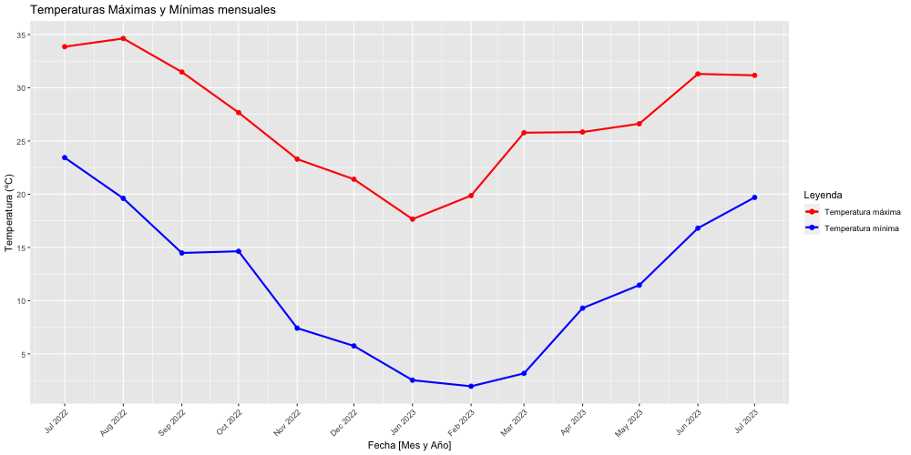

```{r setup, include=FALSE}
knitr::opts_chunk$set(echo = TRUE)
```

```{r load_libraries, include=FALSE}
# Librerías
if(!require("ggplot2")) install.packages("ggplot2"); library("ggplot2")
if(!require("dplyr")) install.packages("dplyr"); library("dplyr")
if(!require("lubridate")) install.packages("lubridate"); library("lubridate")
```

# Connected Scatterplots

Dataset: [**Weather in Spain**](https://www.kaggle.com/datasets/fujichan/weather-in-spain?select=weather_data_Barcelona) de Kaggle

Se ha usado: **weather_data_Barcelona**

## Preparación del dataset

```{r echo=TRUE, message=FALSE, warning=FALSE}
weather_bcn <- read.csv('data/weather_data_Barcelona.csv')
```

```{r echo=TRUE, message=FALSE, warning=FALSE}
weather_bcn$Timestamp <- ymd_hms(weather_bcn$Timestamp)
weather_bcn <- weather_bcn %>% arrange(Timestamp)
weather_bcn$Index <- seq_along(weather_bcn$Timestamp)
```

```{r echo=TRUE, message=FALSE, warning=FALSE}
# Extrae el mes y el año
mes <- month(weather_bcn$Timestamp, label = TRUE)
año <- year(weather_bcn$Timestamp)

# Combina el mes y el año en el formato "Mes/Año"
weather_bcn$Month.Year <- paste(mes, año, sep = " ")
```

```{r echo=TRUE, message=FALSE, warning=FALSE}
bcn_temp <- as.data.frame(weather_bcn %>%
  group_by(Month.Year) %>%
  summarise(Max.Temp = max(Temperature..ºC.), Min.Temp = min(Temperature..ºC.)) %>%
  mutate(Month.Year = as.Date(paste("01", Month.Year, sep = " "), format = "%d %b %Y")) %>%
  arrange(Month.Year)
)
```

## Connected Scatterplots de temperaturas máximas y mínimas menusales en Barcelona

```{r echo=TRUE, message=FALSE, warning=FALSE}
# Abre un dispositivo gráfico PNG
png("connected_scatterplots_temperaturas_barcelona.png", width = 1000, height = 500)
ggplot(data = bcn_temp, aes(x = Month.Year)) +
  geom_line(aes(y = Max.Temp, color = "Temperatura máxima"), size = 1) +
  geom_point(aes(y = Max.Temp, color = "Temperatura máxima"), size = 2) +
  geom_line(aes(y = Min.Temp, color = "Temperatura mínima"), size = 1, linetype = "solid") +
  geom_point(aes(y = Min.Temp, color = "Temperatura mínima"), size = 2) +
  scale_color_manual(values = c("Temperatura máxima" = "red", "Temperatura mínima" = "blue")) +
  labs(x = "Fecha [Mes y Año]", y = "Temperatura (ºC)", color = "Leyenda") +
  ggtitle("Temperaturas Máximas y Mínimas mensuales") +
  scale_y_continuous(breaks = scales::pretty_breaks(n = 10)) +
  scale_x_date(date_breaks = "months", date_labels = "%b %Y") +
  theme(axis.text.x = element_text(angle = 45, hjust = 1))
# Cierra el dispositivo gráfico
dev.off()
```

