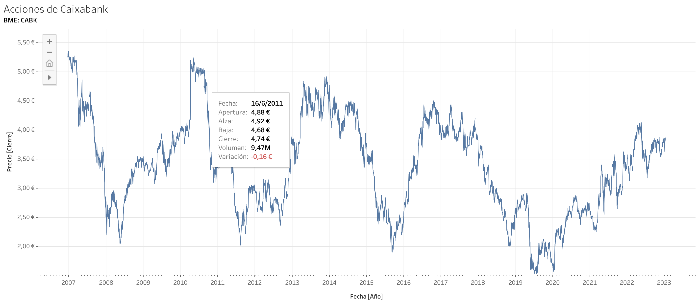
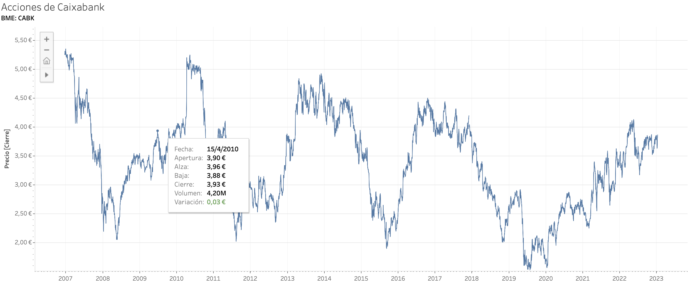
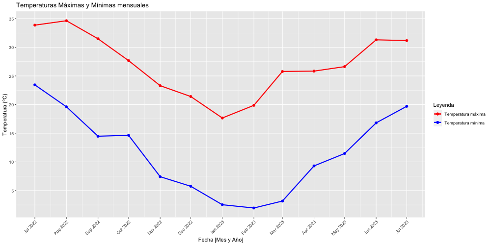
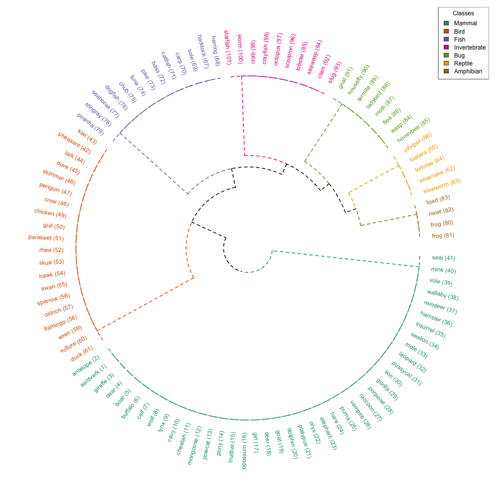
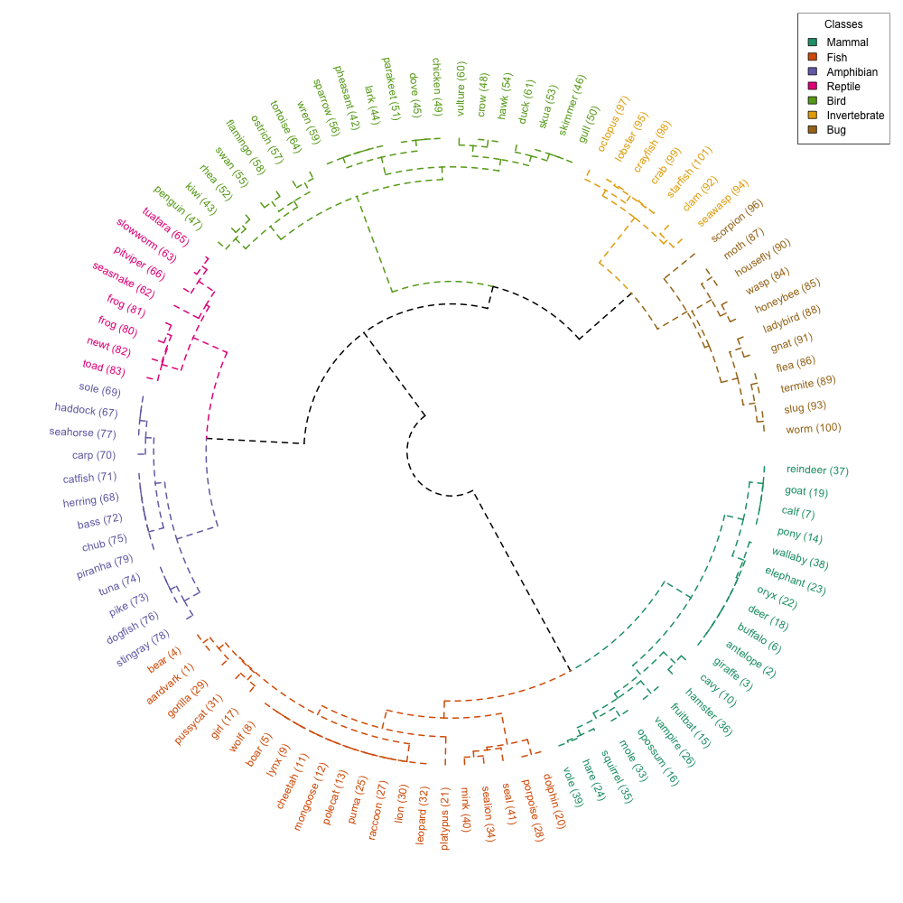

# Visualización de Datos - UOC - PEC 2

## Line chart - Acciones de Caixabank [Tableau]

- Dataset: [Datos y cotizaciones históricas de acciones de CaixaBank](https://es.finance.yahoo.com/quote/CABK.MC/history?p=CABK.MC) de Yahoo Finance
- Licencia: **Uso personal, no comercial**

Visualización interactiva con tooltips y controles de movimiento generada a través de **Tableau** (Para visualizarla correctamente entrar en el enlace de debajo de la imagen)

### Precio de las acciones de Caixabank

Link de la visualización en Tableau: [Acciones de Caixabank](https://public.tableau.com/views/Caixabank-Linechart/Caixabank?:language=es-ES&:display_count=n&:origin=viz_share_link)

----

## Connected Scatterplots - Temperatura de Barcelona [R]

- Dataset: [Weather in Spain](https://www.kaggle.com/datasets/fujichan/weather-in-spain?select=weather_data_Barcelona) de Kaggle
- Licencia: **Desconocida**
- Se ha usado el siguiente fichero: **weather_data_Barcelona**

Visualización estática generada en **R**

Es un gráfico de dispersión conectado por líneas. En concreto, se muestran dos líneas: la primera representa la temperatura máxima de cada mes y la segunda representa la temperatura mínima de cada mes, ambas para la ciudad de Barcelona

### Temperaturas máximas y mínimas mensuales de Bracelona

----

## Circular dendrogram - Animales del Zoo [R]

- Dataset: [Zoo Animal Classification](https://www.kaggle.com/datasets/uciml/zoo-animal-classification) de Kaggle
- Licencia del dataset: **Database Contents License (DbCL) v1.0**
- Se han usado los siguientes ficheros: **zoo** y **class**

Visualización estática generada en **R**

Es un dendrograma circular en el que se clasifican 101 animales de un Zoo por su especie de las cuales hay 7 especies.

Se han creado dos gráficos:

- Uno cclasificando en base a su especie
- Otro clasificando en base a sus atributos para ver si coincide

### Clasificación por especie usando la etiqueta de su clase

Se han distribuido los animales usando la etiqueta de la especie a la que pertenecen

### Clasificación por especie haciendo clustering con sus atributos

Se han distribuido los animales usando el resto de atributos que caracterizan al animal para comprobar si lo clasifica correctamente

